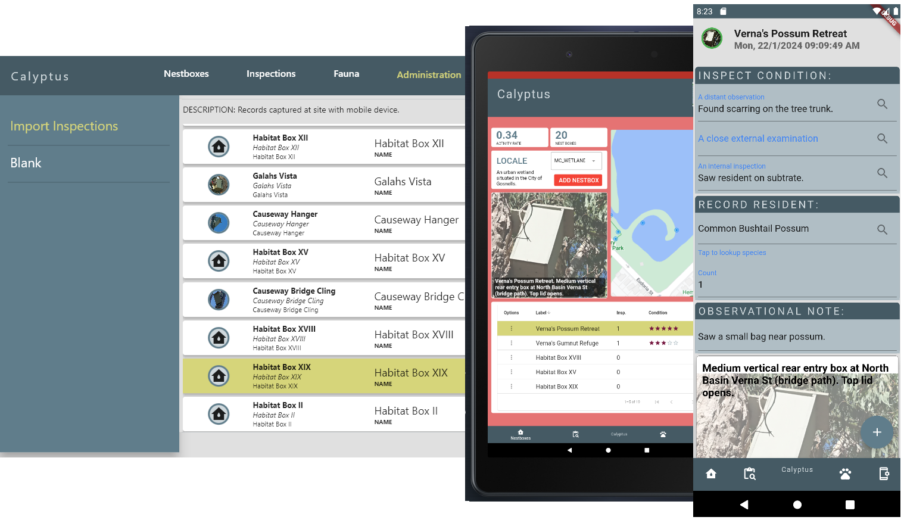

<!-- ABOUT THE PROJECT -->
## Calyptus 

<figure>
    

    
    

</figure>

Calyptus is a nest box monitoring tool used to enrich the surveillance experience by providing feedback on how well an artificial hollow is installed. It was created to speed up time recording observational notes with a conservative approach for minimal distubances to wildlife. It is also used to determine Encounter Probability, Activity Rate and Occupancy Rate for comparison and sharing with wider community.

Is anybody home?! A physical inspection can potentially disturb wildlife, so time spent should be kept at a minimum -- wildlife always comes first!

The tool follows a three step approach:
* A distant observation;
* A close external examination; and
* An internal inspection;

Of course wildlife occurrences are opportunistic, the tool allows you to follow a standardised approach for creating a way for biodiversity conservation outcomes to by measured. A picture of wildlife movements associated with a habitat can easily be visualised.

(<a href="#readme-top">back to top</a>)

### Built With

This project follows the
[simple app state management
tutorial](https://flutter.dev/docs/development/data-and-backend/state-mgmt/simple) as a starting 
point for a Flutter application. The Flutter framework is used to leverage multi-platform
capabilities.

For help getting started with Flutter development, view the
[online documentation](https://flutter.dev/docs), which offers tutorials,
samples, guidance on mobile development, and a full API reference.

* [![Flutter][Flutter.dev]][https://flutter.dev/]

(<a href="#readme-top">back to top</a>)

<!-- ACKNOWLEDGMENTS -->
## Acknowledgments

Inspirations were drawn from experiences at Mary Carroll Wetland. The park serves as a base point
for personal observations.

* [Friends of Mary Carroll Wetland](https://www.sercul.org.au/marycarroll/)
* [Simon Cherriman](https://www.simoncherriman.com.au/)

(<a href="#readme-top">back to top</a>)

